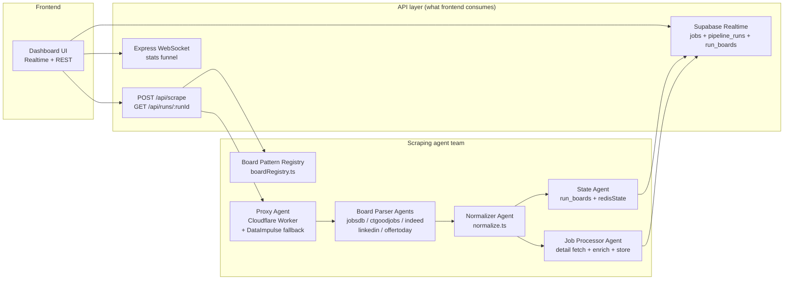
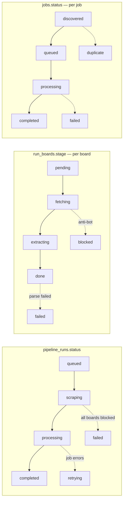
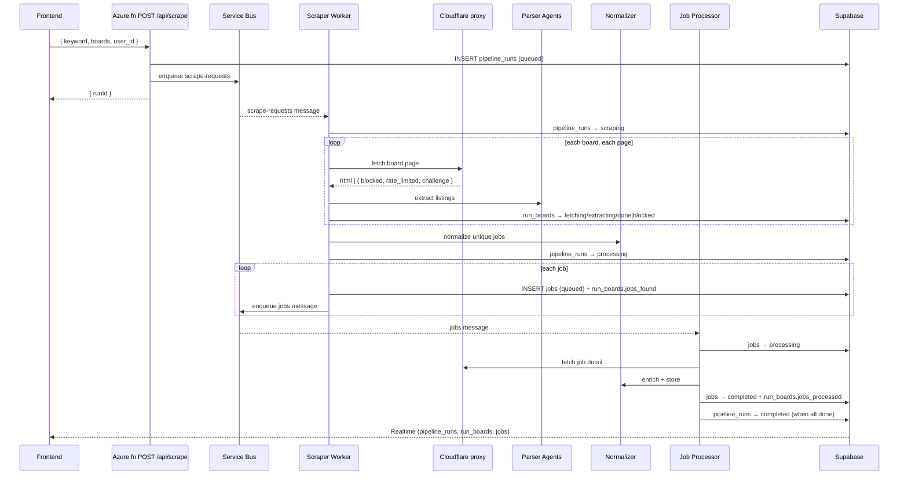

# Job Scraping Agent Team — Architecture

> **Goal:** deliver a high-quality, frontend-ready job scraping API. Two pillars:
>
> 1. **Quality scraping data** — accurate, per-board extraction patterns that are
>    normalized into ONE consistent contract so the frontend consumes it easily.
> 2. **Scraping state** — run + per-board + per-job stages the user can watch live.
>
> This document describes the **agent team** (the responsibilities split across the
> platform) and the **data contracts** they produce. It is the design source of
> truth; the code lives under `azure/functions/src/` (production path).

---

## 1. The team — roles & responsibilities

The scraping system behaves like a small agent team. Each member has one job and
one clear handoff. The frontend never talks to the "agents" directly — it talks to
the **API layer** they feed.



### Agent cards

| Agent                      | File(s)                                                                                | Responsibility                                                                                                                                   | Handoff                                    |
| -------------------------- | -------------------------------------------------------------------------------------- | ------------------------------------------------------------------------------------------------------------------------------------------------ | ------------------------------------------ |
| **Board Pattern Registry** | `src/boardRegistry.ts`                                                                 | Single source of truth for how each board exposes data (data source, anti-bot, extraction quirks). Observed, accurate patterns.                  | Feeds parsers + normalizer + ops docs      |
| **Proxy Agent**            | `cloudflare/jobboard-proxy/src/index.ts`                                               | Routes board fetches, rotates UA, throttles (politeness), caches in KV, returns structured errors (`blocked` / `rate_limited` / `challenge`...). | Raw HTML or structured failure → parser    |
| **Board Parser Agents**    | `src/boardParsers.ts` + `src/publicApiScrapers.ts`                                     | Extract listings from each board's raw HTML / JSON into `ScrapedJob[]`.                                                                          | Raw `ScrapedJob[]` → normalizer            |
| **Normalizer Agent**       | `src/normalize.ts`                                                                     | Turns every board's raw fields into ONE frontend-friendly shape (entities, relative dates, salary, missing fields, data-quality signals).        | Clean `NormalizedJob[]` → fan-out          |
| **State Agent**            | `src/runBoardState.ts`, `src/redisState.ts`, `supabase/migrations/0011_run_boards.sql` | Tracks run stage, per-board stage, per-job status; writes Realtime + Redis funnel counters.                                                      | Live state → UI via Realtime / WS          |
| **Job Processor Agent**    | `src/functions/jobProcessor.ts`                                                        | Fetches each job's full detail, enriches (responsibilities/requirements/skills), stores the normalized row.                                      | `jobs` row (`status=completed`) → Realtime |

---

## 2. Pillar 1 — Quality scraping data

### 2.1 Board pattern registry (observed, accurate)

The registry (`boardRegistry.ts`) encodes how each board ACTUALLY exposes its data.
This is the "observe the accurate patterns" work — it's derived from the parsers
and the Cloudflare proxy config, not from assumptions.

| Board      | Key          | Data source                                                 | Render? | Proxy                                                     | Anti-bot                                |
| ---------- | ------------ | ----------------------------------------------------------- | ------- | --------------------------------------------------------- | --------------------------------------- |
| JobsDB     | `jobsdb`     | DOM `data-automation` attrs → `__NEXT_DATA__` JSON fallback | No      | proxy (residential fallback)                              | Cloudflare, datacenter-blocked          |
| CTgoodjobs | `ctgoodjobs` | Next.js RSC flight payload (`self.__next_f.push`)           | No      | proxy (residential fallback)                              | Cloudflare, CAPTCHA                     |
| Indeed     | `indeed`     | `window.mosaic.providerData` JSON                           | **Yes** | proxy (Cloudflare edge; DataImpulse residential fallback) | Cloudflare, CAPTCHA, datacenter-blocked |
| LinkedIn   | `linkedin`   | Public guest API (HTML fragment)                            | No      | public (0 credits)                                        | rate-limited                            |
| OfferToday | `offertoday` | Public JSON API                                             | No      | public (0 credits)                                        | rate-limited                            |

> **Why a registry?** When a board changes layout (CTgoodjobs already did — from
> cheerio to RSC), you update ONE place. The registry also tells ops which boards
> need paid proxies and which are free.

### 2.2 Per-board quirks the normalizer handles

| Quirk                                    | Boards                     | Normalizer behaviour                  |
| ---------------------------------------- | -------------------------- | ------------------------------------- |
| HTML entities in title (`&amp;`)         | CTgoodjobs, JobsDB         | `cleanText()` decodes + strips tags   |
| Relative posted date (`3d ago`, `Today`) | JobsDB, OfferToday, Indeed | → ISO `YYYY-MM-DD`                    |
| Salary as structured `{min,max,type}`    | Indeed                     | → `"min–max type"` display string     |
| Missing location                         | all                        | → `"Hong Kong"`                       |
| Unparseable posted date (`Promoted`)     | JobsDB                     | → `null` (date unknown)               |
| Missing description on listing           | LinkedIn                   | → fetched on detail page by processor |

### 2.3 Normalized job contract

Every `jobs` row is normalized **before** fan-out, so the frontend gets one shape.
The normalized fields are **stamped onto the Service Bus message** (`applyNormalized`)
and **persisted** by the job processor — so the structured quality contract actually
reaches Supabase and the frontend (not just computed-and-discarded):

```ts
NormalizedJob {
  jobId: string;          // deterministic hash of board|url
  title: string;          // cleaned
  company: string;        // cleaned, "N/A"/missing → "Unknown Company"
  location: string;       // "Hong Kong" default
  salaryDisplay: string | null;   // original display string
  // persisted structured salary (NEW):
  salary: { display, min, max, period, currency, confidence };
  postedDate: string | null;      // ISO YYYY-MM-DD
  url: string;            // deduped
  board: string;
  description: string | null;
  dataQuality: {          // persisted as jobs.data_quality (jsonb)
    completeness: number; // 0–100
    hasSalary: boolean;
    hasDescription: boolean;
    hasPostedDate: boolean;
    hasLocation: boolean;
  };
}
```

**DB columns added (migration `0012`):** `salary_min`, `salary_max`,
`salary_period`, `salary_currency`, `salary_confidence`, `data_quality`.

**Benefits for the frontend:** no per-source branching for entities, dates, or
salary. A card renders from `title/company/location/salaryDisplay/postedDate`
regardless of board. `salary_min/max/currency/period` enable sorting/filtering
without regex. `data_quality` enables badges like "salary unknown". Currency is
inferred (`HKD`) for HK boards when the board emits a numeric-only range (Indeed).

---

## 3. Pillar 2 — Scraping state

### 3.1 Three levels of state



### 3.2 What the frontend reads

| Level  | Source                   | Realtime | UI element                                       |
| ------ | ------------------------ | -------- | ------------------------------------------------ |
| Run    | `pipeline_runs.status`   | ✅       | Header status ("Searching…", "Done ✓")           |
| Board  | `run_boards.stage` (NEW) | ✅       | Board chips (light up per stage)                 |
| Job    | `jobs.status`            | ✅       | Job card badges ("Found", "Loading…", "Saved ✓") |
| Funnel | Redis counters via WS    | ✅       | Scraped → Duplicate → Unique → Processing        |

### 3.3 Board stages (`run_boards`)

| Stage        | Meaning                              | UI copy (per UX spec) |
| ------------ | ------------------------------------ | --------------------- |
| `pending`    | Not started                          | "Waiting…"            |
| `fetching`   | Fetching search pages                | "Searching…"          |
| `extracting` | Parsing listings                     | "Reading listings…"   |
| `blocked`    | Anti-bot / proxy blocked (retryable) | "Blocked — retrying…" |
| `done`       | Extracted successfully               | "Done ✓"              |
| `failed`     | Board failed this run                | "Failed — retry"      |

**Where it's written:** the scraper worker marks `fetching → extracting → done`,
and `blocked` on anti-bot failures. The job processor bumps `jobs_processed` /
`jobs_failed`. **Where it's read:** `GET /api/runs/:runId` returns a `boards`
object; Supabase Realtime on `run_boards` streams it live.

---

## 4. Data flow (end to end)



---

## 5. API surface for the frontend

| Endpoint                            | Purpose                                           |
| ----------------------------------- | ------------------------------------------------- |
| `POST /api/scrape`                  | Start a scrape → `{ runId }`                      |
| `GET /api/runs/:runId`              | Run status + per-board progress + jobsCount       |
| `GET /jobs/:jobId` (legacy Express) | Legacy BullMQ path                                |
| WebSocket                           | Live funnel (scraped/duplicate/unique/processing) |
| Supabase Realtime                   | Live `jobs`, `pipeline_runs`, `run_boards` rows   |

Full contract: `docs/FRONTEND_API.md`.

---

## 6. Failure handling & anti-bot strategy

| Failure                         | Who detects          | Action                                                                                    |
| ------------------------------- | -------------------- | ----------------------------------------------------------------------------------------- |
| Cloudflare challenge on a board | Proxy Agent          | `blocked` → fallback to DataImpulse residential → `run_boards.stage=blocked`, run retries |
| Board returns 0 jobs            | Parser Agent         | `run_boards.stage=failed` (board-level, non-fatal to run)                                 |
| All boards fail                 | Scraper Worker       | `pipeline_runs.status=failed` with `last_error`                                           |
| Detail fetch fails for a job    | Job Processor        | `jobs.status=failed`; Service Bus redelivers (maxDeliveryCount)                           |
| Duplicate URL/title+company     | Scraper Worker dedup | Counted as `duplicate`; not re-inserted                                                   |

**Politeness:** per-board minimum intervals in the Cloudflare worker
(`BOARD_MIN_INTERVAL_MS`) + KV caching of successful pages.

---

## 7. What changed in this work

| File                                                 | Change                                                                                                                                      |
| ---------------------------------------------------- | ------------------------------------------------------------------------------------------------------------------------------------------- |
| `azure/functions/src/boardRegistry.ts`               | **NEW** — accurate per-board pattern registry                                                                                               |
| `azure/functions/src/normalize.ts`                   | **NEW** — normalization layer + data-quality signals; later: `applyNormalized` transport, `boardCurrency` inference, `N/A` sentinel cleanup |
| `azure/functions/src/runBoardState.ts`               | **NEW** — per-board state write helpers                                                                                                     |
| `supabase/migrations/0011_run_boards.sql`            | **NEW** — `run_boards` table + RLS                                                                                                          |
| `supabase/migrations/0012_jobs_quality_contract.sql` | **NEW** — `salary_min/max/period/currency/confidence` + `data_quality` on `jobs`                                                            |
| `azure/functions/src/functions/scraperWorker.ts`     | Wire per-board stages; normalize + `applyNormalized` before fan-out so the quality contract reaches Service Bus                             |
| `azure/functions/src/functions/jobProcessor.ts`      | Persist structured salary + `data_quality` into the `jobs` row                                                                              |
| `azure/functions/src/functions/runStatus.ts`         | Expose `boards` per-board detail                                                                                                            |
| `azure/functions/src/types.ts`                       | `ScrapedJob` `_norm*` transport fields; `JobRow` quality columns                                                                            |
| `azure/functions/src/boardParsers.ts`                | OfferToday HTML fallback no longer emits literal `"N/A"`                                                                                    |
| `docs/FRONTEND_API.md`                               | Document board stages + normalized contract (structured salary + data_quality)                                                              |

---

## 8. Next steps (suggested)

1. **Run migration** `0011_run_boards.sql` in Supabase SQL editor.
2. **Deploy** the updated Azure Functions (`func azure functionapp publish`).
3. **Frontend:** subscribe to Realtime on `run_boards` for per-board chips; use the
   normalized contract for cards (no per-source branching).
4. **Optional:** extend `normalize.ts` to also clean company names / title casing;
   add a `dataQuality` badge UI.
