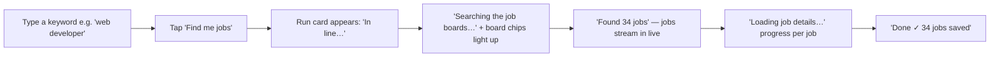

# Jobs Automation — UX Spec (Realtime Dashboard)

> Standing at the point of view of the end user (a busy Hong Kong job seeker).
> Every machine state is translated to warm, honest, human copy. No queues, brokers,
> function apps, or status codes ever reach the user.

> **Scrape-only pipeline.** The platform **scrapes and stores job listings**. There is no AI fit scoring, no cover letters, and no resume generation — so the UI should never reference "fit", "match", "cover letter", or "resume". Every job is simply **found → details loaded → saved**.

## 1. User journey: "Watch my search run live"



## 2. Status → human copy table

### Run (subscription) status — `pipeline_runs.status`

| Machine      | User sees                      | Tone    | Live |
| ------------ | ------------------------------ | ------- | ---- |
| `queued`     | "In line…"                     | neutral | yes  |
| `scraping`   | "Searching the job boards…"    | active  | yes  |
| `processing` | "Loading job details…"         | active  | yes  |
| `completed`  | "Done ✓"                       | success | no   |
| `failed`     | "Something went wrong — retry" | error   | no   |
| `retrying`   | "Hitting a snag, retrying…"    | active  | yes  |

### Job status — `jobs.status`

| Machine      | User sees              | Tone    |
| ------------ | ---------------------- | ------- |
| `discovered` | "Found"                | neutral |
| `queued`     | "In line"              | neutral |
| `scraping`   | "Reading the full ad…" | active  |
| `processing` | "Loading job details…" | active  |
| `completed`  | "Saved ✓"              | success |
| `failed`     | "Failed"               | error   |
| `duplicate`  | "Already saved"        | muted   |

## 3. Screen: Live run dashboard (mobile-first wireframe)

```
┌─────────────────────────────────────┐
│  ◀  My job search            ● 12  │  ← live badge (pulse, reduced-motion off)
│  "web developer"     [Cancel]      │
│  ┌───────────────────────────────┐  │
│  │  ● Searching the job boards…  │  │  ← aria-live="polite"
│  │  ▓ JobsDB  ▓ CTgoodjobs  ▓ Indeed
│  └───────────────────────────────┘  │
│                                     │
│  NEW THIS SEARCH (34)               │
│  ┌─ Frontend Engineer ────────────┐ │
│  │  Acme Ltd · Hong Kong          │ │  ← streams in live
│  │  HKD 35–45k · Saved ✓          │ │
│  └────────────────────────────────┘ │
│  ┌─ Full-stack Dev ───────────────┐ │
│  │  Beta Co · Hong Kong           │ │
│  │  HKD 30–40k · Loading…         │ │
│  └────────────────────────────────┘ │
│                                     │
│  [View all 34 →]                    │
└─────────────────────────────────────┘
```

Key UX rules:

- **Realtime = alive**: rows insert/update in place, no refresh, with a subtle fade-in (300ms) — and **no motion** under `prefers-reduced-motion`.
- **Progressive disclosure**: title + company + salary first; tapping opens the full parsed description (responsibilities, requirements, benefits, skills).
- **Batching calm**: if many jobs arrive at once, group them under section headers rather than animating 50 cards.

## 4. Empty / error states

| State         | Copy                                                               | Action                         |
| ------------- | ------------------------------------------------------------------ | ------------------------------ |
| No results    | "Nothing found for 'xyz'. Try a different keyword or more boards." | Retry / edit keyword           |
| Board blocked | "JobsDB was busy — we tried again but couldn't get through."       | Auto-retry badge on that board |
| Run failed    | "Something went wrong. Your saved jobs are safe."                  | Retry button                   |
| Quota/overage | "You've hit today's search limit. It resets at midnight."          | Upgrade / come back later      |

## 5. Accessibility notes

- Status text uses `role="status"` / `aria-live="polite"` so screen readers announce live changes.
- Status chips are color + text (never color alone) to meet WCAG 1.4.1.
- All interactive targets ≥ 44×44px; contrast ≥ 4.5:1 for body text.

## 6. Acceptance criteria (UX)

1. A user submits a search and sees the run card transition through plain-English states with no refresh.
2. New jobs stream in live and show their detail-loading / saved state.
3. Every state has an accessible announcement and a calm, reduced-motion fallback.
4. No technical jargon (queue, broker, function, RPC) appears anywhere in the UI.
5. **No AI references** — the UI never mentions fit scores, match percentages, cover letters, or resumes.
